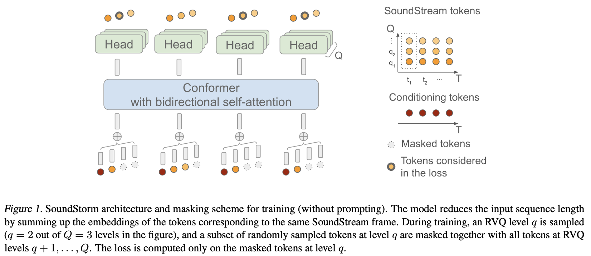

</img>

## Soundstorm - Pytorch

Implementation of <a href="https://arxiv.org/abs/2305.09636">SoundStorm</a>, Efficient Parallel Audio Generation from Google Deepmind, in Pytorch.

They basically applied <a href="https://arxiv.org/abs/2202.04200">MaskGiT</a> to the residual vector quantized codes from <a href="https://github.com/lucidrains/audiolm-pytorch#soundstream--encodec">Soundstream</a>. The transformer architecture they chose to use is one that fits well with the audio domain, named <a href="https://arxiv.org/abs/2005.08100">Conformer</a>

<a href="https://google-research.github.io/seanet/soundstorm/examples/">Project Page</a>

## Appreciation

- <a href="https://stability.ai/">Stability</a> and <a href="https://huggingface.co/">🤗 Huggingface</a> for their generous sponsorships to work on and open source cutting edge artificial intelligence research

- <a href="https://github.com/lucasnewman">Lucas Newman</a> for numerous contributions, including the initial training code, acoustic prompting logic, per-level quantizer decoding!

- <a href="https://huggingface.co/docs/accelerate/index">🤗 Accelerate</a> for providing a simple and powerful solution for training

- <a href="https://einops.rocks/">Einops</a> for the indispensable abstraction that makes building neural networks fun, easy, and uplifting

- <a href="https://github.com/stevenhillis">Steven Hillis</a> for submitting the correct masking strategy and for verifying that the repository works! 🙏

- <a href="https://github.com/lucasnewman">Lucas Newman</a> for basically training a small working Soundstorm with models across multiple repositories, showing it all works end-to-end. Models include <a href="https://github.com/lucidrains/audiolm-pytorch">SoundStream</a>, <a href="https://github.com/lucidrains/spear-tts-pytorch">Text-to-Semantic T5</a>, and finally the SoundStorm transformer here.

- <a href="https://github.com/Jiang-Stan">@Jiang-Stan</a> for identifying a critical bug in the iterative demasking!

## Install

```bash
$ pip install soundstorm-pytorch
```

## Usage

```python
import torch
from soundstorm_pytorch import SoundStorm, ConformerWrapper

conformer = ConformerWrapper(
    codebook_size = 1024,
    num_quantizers = 12,
    conformer = dict(
        dim = 512,
        depth = 2
    ),
)

model = SoundStorm(
    conformer,
    steps = 18,          # 18 steps, as in original maskgit paper
    schedule = 'cosine'  # currently the best schedule is cosine
)

# get your pre-encoded codebook ids from the soundstream from a lot of raw audio

codes = torch.randint(0, 1024, (2, 1024, 12)) # (batch, seq, num residual VQ)

# do the below in a loop for a ton of data

loss, _ = model(codes)
loss.backward()

# model can now generate in 18 steps. ~2 seconds sounds reasonable

generated = model.generate(1024, batch_size = 2) # (2, 1024)
```

To directly train on raw audio, you need to pass in your pretrained `SoundStream` into `SoundStorm`. You can train your own `SoundStream` at <a href="https://github.com/lucidrains/audiolm-pytorch#soundstream--encodec">audiolm-pytorch</a>.

```python
import torch
from soundstorm_pytorch import SoundStorm, ConformerWrapper, Conformer, SoundStream

conformer = ConformerWrapper(
    codebook_size = 1024,
    num_quantizers = 12,
    conformer = dict(
        dim = 512,
        depth = 2
    ),
)

soundstream = SoundStream(
    codebook_size = 1024,
    rq_num_quantizers = 12,
    attn_window_size = 128,
    attn_depth = 2
)

model = SoundStorm(
    conformer,
    soundstream = soundstream   # pass in the soundstream
)

# find as much audio you'd like the model to learn

audio = torch.randn(2, 10080)

# course it through the model and take a gazillion tiny steps

loss, _ = model(audio)
loss.backward()

# and now you can generate state-of-the-art speech

generated_audio = model.generate(seconds = 30, batch_size = 2)  # generate 30 seconds of audio (it will calculate the length in seconds based off the sampling frequency and cumulative downsamples in the soundstream passed in above)
```

Complete text-to-speech will rely on a trained `TextToSemantic` encoder / decoder transformer. You will then load the weights and pass it into the `SoundStorm` as `spear_tts_text_to_semantic`

This is a work-in-progress, as `spear-tts-pytorch` only has the model architecture complete, and not the pretraining + pseudo-labeling + backtranslation logic.

```python
from spear_tts_pytorch import TextToSemantic

text_to_semantic = TextToSemantic(
    dim = 512,
    source_depth = 12,
    target_depth = 12,
    num_text_token_ids = 50000,
    num_semantic_token_ids = 20000,
    use_openai_tokenizer = True
)

# load the trained text-to-semantic transformer

text_to_semantic.load('/path/to/trained/model.pt')

# pass it into the soundstorm

model = SoundStorm(
    conformer,
    soundstream = soundstream,
    spear_tts_text_to_semantic = text_to_semantic
).cuda()

# and now you can generate state-of-the-art speech

generated_speech = model.generate(
    texts = [
        'the rain in spain stays mainly in the plain',
        'the quick brown fox jumps over the lazy dog'
    ]
) # (2, n) - raw waveform decoded from soundstream
```

## Todo

- [x] integrate soundstream
- [x] when generating, and length can be defined in seconds (takes into sampling freq etc)
- [x] make sure grouped rvq is supported. concat embeddings rather than sum across group dimension
- [x] just copy conformer over and redo shaw's relative positional embedding with rotary embedding. nobody uses shaw anymore.
- [x] default flash attention to true
- [x] remove batchnorm, and just use layernorm, but after the swish (as in normformer paper)
- [x] trainer with accelerate - thanks to @lucasnewman
- [x] allow for variable lengthed sequence training and generation, by passing in `mask` at `forward` and `generate`

- [ ] option to return list of audio files when generating
- [ ] turn it into a command line tool
- [ ] add cross attention and adaptive layernorm conditioning

## Citations

```bibtex
@misc{borsos2023soundstorm,
    title   = {SoundStorm: Efficient Parallel Audio Generation}, 
    author  = {Zalán Borsos and Matt Sharifi and Damien Vincent and Eugene Kharitonov and Neil Zeghidour and Marco Tagliasacchi},
    year    = {2023},
    eprint  = {2305.09636},
    archivePrefix = {arXiv},
    primaryClass = {cs.SD}
}
```

```bibtex
@inproceedings{dao2022flashattention,
    title   = {Flash{A}ttention: Fast and Memory-Efficient Exact Attention with {IO}-Awareness},
    author  = {Dao, Tri and Fu, Daniel Y. and Ermon, Stefano and Rudra, Atri and R{\'e}, Christopher},
    booktitle = {Advances in Neural Information Processing Systems},
    year    = {2022}
}
```

```bibtex
@article{Chang2022MaskGITMG,
    title   = {MaskGIT: Masked Generative Image Transformer},
    author  = {Huiwen Chang and Han Zhang and Lu Jiang and Ce Liu and William T. Freeman},
    journal = {2022 IEEE/CVF Conference on Computer Vision and Pattern Recognition (CVPR)},
    year    = {2022},
    pages   = {11305-11315}
}
```

```bibtex
@article{Lezama2022ImprovedMI,
    title   = {Improved Masked Image Generation with Token-Critic},
    author  = {Jos{\'e} Lezama and Huiwen Chang and Lu Jiang and Irfan Essa},
    journal = {ArXiv},
    year    = {2022},
    volume  = {abs/2209.04439}
}
```

```bibtex
@inproceedings{Nijkamp2021SCRIPTSP,
    title   = {SCRIPT: Self-Critic PreTraining of Transformers},
    author  = {Erik Nijkamp and Bo Pang and Ying Nian Wu and Caiming Xiong},
    booktitle = {North American Chapter of the Association for Computational Linguistics},
    year    = {2021}
}
```

```bibtex
@inproceedings{rogozhnikov2022einops,
    title   = {Einops: Clear and Reliable Tensor Manipulations with Einstein-like Notation},
    author  = {Alex Rogozhnikov},
    booktitle = {International Conference on Learning Representations},
    year    = {2022},
    url     = {https://openreview.net/forum?id=oapKSVM2bcj}
}
```

```bibtex
@misc{su2021roformer,
    title   = {RoFormer: Enhanced Transformer with Rotary Position Embedding},
    author  = {Jianlin Su and Yu Lu and Shengfeng Pan and Bo Wen and Yunfeng Liu},
    year    = {2021},
    eprint  = {2104.09864},
    archivePrefix = {arXiv},
    primaryClass = {cs.CL}
}
```
